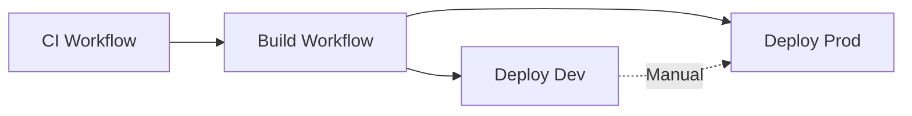

# GitHub Actions Workflows

This directory contains CI/CD workflows for building and deploying the GitHub Migrator application.

## Workflows

### terraform-dev.yml - Infrastructure Deployment (Dev)

**Triggers:**
- Manual workflow dispatch

**Actions:**
- `plan` - Preview infrastructure changes
- `apply` - Create/update infrastructure
- `destroy` - Destroy infrastructure

**What it does:**
1. Creates `terraform.tfvars` from GitHub Secrets
2. Runs Terraform commands in `terraform/environments/dev/`
3. Deploys Azure App Service with SQLite
4. Outputs app service name and URL

**Required Secrets:**
- All secrets from [GITHUB_SECRETS_SETUP.md](../../docs/GITHUB_SECRETS_SETUP.md)

**Usage:**
```
Actions → Terraform Deploy - Dev → Run workflow
Select action: plan (to preview) or apply (to create)
```

### terraform-prod.yml - Infrastructure Deployment (Production)

**Triggers:**
- Manual workflow dispatch
- Requires `production` environment approval

**Actions:**
- `plan` - Preview infrastructure changes
- `apply` - Create/update infrastructure
- `destroy` - Destroy infrastructure

**What it does:**
1. Creates `terraform.tfvars` from GitHub Secrets
2. Runs Terraform commands in `terraform/environments/prod/`
3. Deploys Azure App Service + PostgreSQL
4. Outputs app service name, URL, and database info

**Required Secrets:**
- All secrets from [GITHUB_SECRETS_SETUP.md](../../docs/GITHUB_SECRETS_SETUP.md)

**Usage:**
```
Actions → Terraform Deploy - Production → Run workflow
Select action: plan (to preview) or apply (to create)
```

### ci.yml - Continuous Integration

**Triggers:**
- Push to `main` or `develop` branches
- Pull requests to `main` or `develop`
- Manual workflow dispatch

**What it does:**

**Backend CI (Go):**
1. Runs `go vet` for static analysis
2. Checks code formatting with `gofmt`
3. Runs `golangci-lint` for comprehensive linting
4. Downloads git-sizer for tests
5. Runs all tests with race detection and coverage
6. Generates coverage reports
7. Uploads coverage to Codecov (optional)
8. Validates minimum coverage thresholds

**Frontend CI (React/TypeScript):**
1. Installs dependencies with `npm ci`
2. Runs TypeScript type checking
3. Runs ESLint for code quality
4. Builds the frontend production bundle
5. Validates build output
6. Uploads build artifacts

**Security Scanning:**
1. Runs Trivy vulnerability scanner on filesystem
2. Runs Gosec security scanner for Go code
3. Uploads results to GitHub Security tab

**Dependency Check:**
1. Runs `govulncheck` for Go vulnerabilities
2. Runs `npm audit` for npm vulnerabilities

**Docker Build Test:**
1. Validates that Docker image builds successfully
2. Uses build cache for efficiency

**CI Summary:**
1. Aggregates all job results
2. Creates summary report
3. Fails if critical jobs fail

**Required for:**
- All pull requests (recommended branch protection)
- Merge to main/develop branches

### build.yml - Build and Push Container Image

**Triggers:**
- Push to `main` branch
- Pull requests to `main`
- Release tags (`v*`)
- Manual workflow dispatch

**What it does:**
1. Builds multi-stage Docker image (frontend + backend)
2. Tags image appropriately based on trigger
3. Pushes to GitHub Container Registry (GHCR)
4. Caches layers for faster builds

**Image Tags:**
- `dev` - Latest from main branch
- `latest` - Latest from main branch
- `main-sha-xxxxxx` - Specific commit from main
- `v1.0.0` - Semantic version tags
- `pr-123` - Pull request builds

**Required Permissions:**
- `contents: read` - Read repository
- `packages: write` - Push to GHCR

### deploy-dev.yml - Deploy to Dev Environment

**Triggers:**
- After successful build on `main` branch
- Manual workflow dispatch

**What it does:**
1. Logs into Azure using service principal
2. Deploys `dev` tagged image to Dev App Service
3. Runs health checks
4. Generates deployment summary

**Required Secrets:**
- `AZURE_CREDENTIALS` - Service principal JSON
- `AZURE_APP_SERVICE_NAME_DEV` - Dev App Service name

**Environment:** `dev`

### deploy-prod.yml - Deploy to Production Environment

**Triggers:**
- Release published
- Manual workflow dispatch (with image tag input)

**What it does:**
1. Determines image tag (from release or manual input)
2. Logs into Azure using service principal
3. Deploys specified image to Production App Service
4. Runs health checks and verification
5. Generates deployment summary
6. Notifies on failure

**Required Secrets:**
- `AZURE_CREDENTIALS` - Service principal JSON
- `AZURE_APP_SERVICE_NAME_PROD` - Production App Service name

**Environment:** `production` (with required reviewers)

## Workflow Dependencies



**Recommended Flow:**
1. CI runs on PR → validates code quality
2. Merge PR → triggers build → creates container image
3. Build success → auto-deploys to dev
4. Manual trigger → deploys to production

## Setup Instructions

### 1. Configure GitHub Secrets

Navigate to: Repository → Settings → Secrets and variables → Actions

Add these secrets:

#### Required for All Workflows

| Secret | Description | How to Get |
|--------|-------------|------------|
| `AZURE_CREDENTIALS` | Service principal JSON | See "Create Service Principal" below |
| `AZURE_SUBSCRIPTION_ID` | Azure subscription ID | `az account show --query id -o tsv` |
| `AZURE_RESOURCE_GROUP` | Resource group name | From Terraform outputs |
| `AZURE_APP_SERVICE_NAME_DEV` | Dev App Service name | From Terraform dev outputs |
| `AZURE_APP_SERVICE_NAME_PROD` | Production App Service name | From Terraform prod outputs |

### 2. Create Azure Service Principal

```bash
# Login to Azure
az login

# Get subscription ID
SUBSCRIPTION_ID=$(az account show --query id -o tsv)

# Get resource group (or create it first)
RESOURCE_GROUP="your-resource-group-name"

# Create service principal with contributor access to resource group
az ad sp create-for-rbac \
  --name "github-migrator-deploy" \
  --role contributor \
  --scopes /subscriptions/$SUBSCRIPTION_ID/resourceGroups/$RESOURCE_GROUP \
  --sdk-auth
```

Copy the entire JSON output and save it as `AZURE_CREDENTIALS` secret.

### 3. Configure GitHub Environments

#### Create Dev Environment

1. Go to: Repository → Settings → Environments
2. Click "New environment"
3. Name: `dev`
4. No protection rules needed
5. Click "Configure environment"

#### Create Production Environment

1. Go to: Repository → Settings → Environments
2. Click "New environment"
3. Name: `production`
4. Configure protection rules:
   - ✅ Required reviewers (add yourself and/or team members)
   - ✅ Wait timer: 5 minutes (optional)
   - ✅ Prevent administrators from bypassing (optional)
5. Click "Save protection rules"

### 4. Enable Workflow Permissions

1. Go to: Repository → Settings → Actions → General
2. Scroll to "Workflow permissions"
3. Select: ✅ Read and write permissions
4. Check: ✅ Allow GitHub Actions to create and approve pull requests
5. Click "Save"

## Usage

### Run CI Checks

#### Automatic (on PR or push)

CI automatically runs on:
- All pull requests to `main` or `develop`
- All pushes to `main` or `develop`

#### Manual CI Run

1. Go to: Actions → Continuous Integration
2. Click "Run workflow"
3. Select branch
4. Click "Run workflow"

#### View CI Results

1. Go to the Pull Request or commit
2. Scroll to checks section at the bottom
3. View detailed results for each job:
   - ✅ Backend CI (Go)
   - ✅ Frontend CI (React/TypeScript)
   - ✅ Security Scanning
   - ✅ Dependency Check
   - ✅ Docker Build Test

### Build a New Image

#### Automatic (on push to main)

```bash
git checkout main
git pull
# Make changes
git add .
git commit -m "feat: add new feature"
git push
```

The build workflow will automatically trigger and push images tagged as `dev` and `latest`.

#### Manual Build

1. Go to: Actions → Build and Push Container Image
2. Click "Run workflow"
3. Select branch: `main`
4. Click "Run workflow"

### Deploy to Dev

#### Automatic (after successful build)

Automatically deploys when build succeeds on `main` branch.

#### Manual Deploy

1. Go to: Actions → Deploy to Dev Environment
2. Click "Run workflow"
3. Select branch: `main`
4. Click "Run workflow"

### Deploy to Production

#### From Release

1. Create a release:
   ```bash
   git tag v1.0.0
   git push origin v1.0.0
   ```

2. Go to: Repository → Releases → Draft a new release
3. Choose tag: `v1.0.0`
4. Fill in release notes
5. Click "Publish release"

The production deployment workflow will automatically trigger.

#### Manual Deploy

1. Ensure the image tag exists in GHCR
2. Go to: Actions → Deploy to Production Environment
3. Click "Run workflow"
4. Enter image tag (e.g., `v1.0.0` or `prod`)
5. Click "Run workflow"
6. **Approve the deployment** if required reviewers are configured

### Approve Production Deployment

If you configured required reviewers:

1. Workflow will wait for approval
2. You'll receive a notification
3. Go to: Actions → Deploy to Production Environment → [Workflow run]
4. Click "Review deployments"
5. Select `production` environment
6. Add comment (optional)
7. Click "Approve and deploy"

## Monitoring Deployments

### View Workflow Status

1. Go to: Actions tab
2. Select workflow (Build, Deploy Dev, or Deploy Prod)
3. View runs and their status

### View Deployment History

1. Go to: Actions tab
2. Filter by workflow and environment
3. Review past deployments, approvals, and results

### Check Deployment Logs

Each workflow step shows detailed logs:

1. Click on a workflow run
2. Click on a job (e.g., "deploy-dev")
3. Expand steps to view logs
4. Download logs if needed

## Workflow Customization

### Change Build Triggers

Edit `.github/workflows/build.yml`:

```yaml
on:
  push:
    branches:
      - main
      - develop  # Add additional branches
```

### Change Image Tags

Edit tag generation in `build.yml`:

```yaml
- name: Extract metadata for Docker
  id: meta
  uses: docker/metadata-action@v5
  with:
    tags: |
      type=ref,event=branch
      type=semver,pattern={{version}}
      # Add custom tags
      type=raw,value=custom-tag
```

### Change Health Check URL

Edit health check step in deploy workflows:

```yaml
- name: Health check
  run: |
    APP_URL="${{ steps.deploy.outputs.webapp-url }}"
    curl -f -s "${APP_URL}/api/custom-health"
```

### Add Deployment Notifications

Add notification step at end of workflow:

```yaml
- name: Notify Slack
  if: success()
  uses: slackapi/slack-github-action@v1
  with:
    payload: |
      {
        "text": "Deployment successful!"
      }
  env:
    SLACK_WEBHOOK_URL: ${{ secrets.SLACK_WEBHOOK }}
```

## Troubleshooting

### CI Failures

#### Backend Tests Fail

**Issue:** Go tests fail in CI

**Solutions:**
1. Run tests locally first: `go test -v ./...`
2. Check for race conditions: `go test -race ./...`
3. Ensure git-sizer binary downloads successfully
4. Check test coverage requirements
5. Review test logs in CI output

#### Frontend Build Fails

**Issue:** Frontend build fails in CI

**Solutions:**
1. Run build locally: `cd web && npm run build`
2. Check TypeScript errors: `npm run type-check`
3. Fix ESLint issues: `npm run lint`
4. Ensure all dependencies are in package.json
5. Clear npm cache if needed: `npm ci`

#### Linting Failures

**Issue:** golangci-lint or ESLint fails

**Solutions:**
1. Run locally:
   - Go: `golangci-lint run`
   - Frontend: `cd web && npm run lint`
2. Auto-fix when possible:
   - Go: `gofmt -s -w .`
   - Frontend: `cd web && npm run lint --fix`
3. Review `.golangci.yml` configuration
4. Check specific linter messages

#### Security Scan Issues

**Issue:** Security vulnerabilities detected

**Solutions:**
1. Review Trivy and Gosec reports in artifacts
2. Update vulnerable dependencies:
   - Go: `go get -u <package>` and `go mod tidy`
   - npm: `npm audit fix`
3. Check if vulnerabilities are false positives
4. Add exceptions if needed (document why)

### Build Fails

**Issue:** Docker build fails

**Solutions:**
1. Check Dockerfile syntax
2. Verify frontend builds locally: `cd web && npm run build`
3. Verify backend builds locally: `go build ./cmd/server`
4. Check workflow logs for specific errors

### Container Push Fails

**Issue:** Cannot push to GHCR

**Solutions:**
1. Verify workflow permissions are set to "Read and write"
2. Check package visibility settings
3. Ensure `packages: write` permission in workflow

### Deployment Fails - Authentication

**Issue:** Azure authentication fails

**Solutions:**
1. Verify `AZURE_CREDENTIALS` secret is correct
2. Recreate service principal if expired
3. Verify service principal has contributor access to resource group

### Deployment Fails - Image Pull

**Issue:** App Service can't pull image

**Solutions:**
1. Verify image exists in GHCR:
   ```bash
   docker pull ghcr.io/YOUR_USERNAME/github-migrator:dev
   ```
2. Check App Service container settings in Azure Portal
3. Verify registry credentials are configured correctly in Terraform

### Health Check Fails

**Issue:** Health check returns 404 or 500

**Solutions:**
1. Check App Service logs:
   ```bash
   az webapp log tail --name YOUR_APP_NAME --resource-group YOUR_RG
   ```
2. Verify health endpoint is `/health`
3. Check environment variables are set correctly
4. Increase wait time before health check

### Workflow Won't Trigger

**Issue:** Workflow doesn't run automatically

**Solutions:**
1. Check workflow file is in `.github/workflows/` directory
2. Verify YAML syntax: `yamllint .github/workflows/*.yml`
3. Check trigger conditions match your branch/tag
4. Ensure workflows are enabled: Settings → Actions → General

## Branch Protection Rules

Recommended branch protection for `main`:

1. Go to: Repository → Settings → Branches → Add rule
2. Branch name pattern: `main`
3. Enable:
   - ✅ Require a pull request before merging
   - ✅ Require approvals (at least 1)
   - ✅ Require status checks to pass before merging
     - Select: `Backend CI (Go)`
     - Select: `Frontend CI (React/TypeScript)`
     - Select: `Docker Build Test`
   - ✅ Require conversation resolution before merging
   - ✅ Do not allow bypassing the above settings
4. Click "Create" or "Save changes"

This ensures:
- All code is reviewed
- All tests pass before merge
- Build succeeds before merge
- No broken code reaches main

## Best Practices

1. **Run CI on all PRs**
   - Never merge without passing CI
   - Review coverage reports
   - Fix linting issues

2. **Always test in dev before prod**
   - Deploy to dev first
   - Verify functionality
   - Then deploy to prod

2. **Use semantic versioning for releases**
   - Format: `v1.2.3`
   - Major: Breaking changes
   - Minor: New features
   - Patch: Bug fixes

3. **Write descriptive commit messages**
   - Helps in deployment summaries
   - Easier to track changes

4. **Review deployment summaries**
   - Check after each deployment
   - Verify correct image was deployed

5. **Monitor after deployment**
   - Watch logs for errors
   - Check health metrics
   - Verify application functions

6. **Use required reviewers for prod**
   - Adds safety gate
   - Allows for final checks

7. **Tag stable versions**
   - Makes rollbacks easier
   - Clear version history

8. **Keep workflows updated**
   - Update action versions regularly
   - Test workflow changes in branches

## Rollback Procedures

### Rollback Dev Environment

```bash
# Find previous working image tag
docker image ls ghcr.io/YOUR_USERNAME/github-migrator

# Deploy previous tag manually
# Go to Actions → Deploy to Dev → Run workflow
# Use the previous working tag
```

### Rollback Production

#### Option 1: Via GitHub Actions

1. Go to Actions → Deploy to Production
2. Click "Run workflow"
3. Enter previous stable tag (e.g., `v1.0.0`)
4. Approve deployment

#### Option 2: Via Azure CLI

```bash
# Set variables
APP_NAME="your-app-name-prod"
RG="your-resource-group"
IMAGE="ghcr.io/username/github-migrator:v1.0.0"

# Update container image
az webapp config container set \
  --name $APP_NAME \
  --resource-group $RG \
  --docker-custom-image-name $IMAGE

# Restart app
az webapp restart \
  --name $APP_NAME \
  --resource-group $RG
```

#### Option 3: Via Terraform

```bash
cd terraform/environments/prod

# Update terraform.tfvars
# docker_image_tag = "v1.0.0"

terraform apply
```

## Security Considerations

1. **Secrets Management**
   - Never log secrets
   - Use GitHub secrets, not environment variables in code
   - Rotate service principal credentials regularly

2. **Least Privilege**
   - Service principal should have minimum required permissions
   - Scope to resource group, not subscription

3. **Branch Protection**
   - Require pull request reviews for main branch
   - Require status checks to pass before merging

4. **Audit Logs**
   - Review workflow runs regularly
   - Check for unauthorized deployments

5. **Image Scanning**
   - Consider adding security scanning step
   - Use tools like Trivy or Snyk

## Additional Resources

- [GitHub Actions Documentation](https://docs.github.com/en/actions)
- [Docker Build Push Action](https://github.com/docker/build-push-action)
- [Azure Web Apps Deploy Action](https://github.com/Azure/webapps-deploy)
- [GitHub Container Registry](https://docs.github.com/en/packages/working-with-a-github-packages-registry/working-with-the-container-registry)
- [Azure Service Principal](https://docs.microsoft.com/en-us/azure/active-directory/develop/app-objects-and-service-principals)

