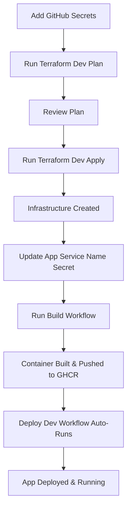

# Terraform Deployment Quick Start

Complete guide to deploy GitHub Migrator to Azure using Terraform via GitHub Actions.

## 🎯 Overview

This setup allows you to:
- Deploy infrastructure using Terraform from GitHub Actions
- Keep all secrets in GitHub Secrets (nothing in code)
- Separate dev and production environments
- Deploy application containers automatically after infrastructure is ready

## ⚡ Quick Start (30 minutes)

### Step 1: Prepare Azure (5 minutes)

```bash
# Login to Azure
az login

# Create resource group if it doesn't exist
az group create --name github-migrator-rg --location eastus

# Create service principal
az ad sp create-for-rbac \
  --name "github-migrator-deploy" \
  --role contributor \
  --scopes /subscriptions/$(az account show --query id -o tsv)/resourceGroups/github-migrator-rg \
  --sdk-auth
```

**Save the JSON output** - you'll need it for GitHub Secrets.

### Step 2: Set Up GitHub Environments (10 minutes)

**🆕 Recommended Approach:** Use GitHub Environments for better organization.

**Follow:** [GITHUB_ENVIRONMENTS_SETUP.md](./GITHUB_ENVIRONMENTS_SETUP.md)

**Or use the quick approach below** (repository-level secrets):

Go to: **Repository → Settings → Secrets and variables → Actions**

Add these **minimum required secrets**:

| Secret Name | Value | Command to Get |
|------------|-------|----------------|
| `AZURE_CREDENTIALS` | JSON from Step 1 | (from service principal output) |
| `AZURE_SUBSCRIPTION_ID` | Your subscription ID | `az account show --query id -o tsv` |
| `AZURE_RESOURCE_GROUP` | `github-migrator-rg` | (or your resource group name) |
| `SOURCE_GITHUB_TOKEN` | GitHub PAT | Create at GitHub Settings → Developer settings → PAT |
| `DEST_GITHUB_TOKEN` | GitHub PAT | (can be same as source) |

**Optional but recommended** (for authentication):

| Secret Name | Value |
|------------|-------|
| `AUTH_ENABLED_DEV` | `false` (set to `true` to enable) |
| `AUTH_ENABLED_PROD` | `true` |
| `AUTH_GITHUB_OAUTH_CLIENT_ID_DEV` | (from GitHub OAuth App) |
| `AUTH_GITHUB_OAUTH_CLIENT_SECRET_DEV` | (from GitHub OAuth App) |
| `AUTH_SESSION_SECRET_DEV` | `openssl rand -base64 32` |
| `AUTH_GITHUB_OAUTH_CLIENT_ID_PROD` | (separate OAuth app for prod) |
| `AUTH_GITHUB_OAUTH_CLIENT_SECRET_PROD` | (from prod OAuth app) |
| `AUTH_SESSION_SECRET_PROD` | `openssl rand -base64 32` |

> 📚 **Complete setup guide:** [GITHUB_SECRETS_SETUP.md](./GITHUB_SECRETS_SETUP.md)

### Step 3: Deploy Dev Infrastructure (5 minutes)

1. Go to **Actions → Terraform Deploy - Dev**
2. Click **Run workflow**
3. Select action: **`plan`**
4. Review the plan output
5. Run workflow again with action: **`apply`**
6. Wait for completion (~3-5 minutes)
7. **Save the app service name** from outputs

### Step 4: Update Deployment Secrets (2 minutes)

Add these secrets with values from Terraform outputs:

| Secret Name | Value |
|------------|-------|
| `AZURE_APP_SERVICE_NAME_DEV` | `github-migrator-dev` |
| `AZURE_APP_SERVICE_NAME_PROD` | `github-migrator-prod` |

### Step 5: Build and Deploy Application (5 minutes)

1. Go to **Actions → Build and Push Container Image**
2. Click **Run workflow** (will create `dev` tagged image)
3. Wait for build to complete
4. **Deploy Dev workflow** will automatically trigger and deploy

That's it! Your dev environment is live at: `https://github-migrator-dev.azurewebsites.net`

### Step 6: Deploy Production (Optional, 10 minutes)

1. Go to **Actions → Terraform Deploy - Production**
2. Click **Run workflow**
3. Select action: **`plan`**
4. Review carefully
5. Run again with action: **`apply`**
6. Wait for completion (~10-15 minutes - includes database)
7. Build container with `prod` tag
8. Deploy production workflow

## 🔄 Complete Deployment Flow



## 📋 Deployment Checklist

### Pre-deployment
- [ ] Azure subscription with contributor access
- [ ] Resource group created
- [ ] Service principal created with correct permissions
- [ ] All required GitHub Secrets added
- [ ] GitHub OAuth apps created (if using auth)

### Infrastructure Deployment
- [ ] Terraform plan reviewed and approved
- [ ] Terraform apply completed successfully
- [ ] App service name saved
- [ ] Database credentials saved (production only)

### Application Deployment
- [ ] Container image built successfully
- [ ] Container pushed to GHCR
- [ ] Deploy workflow completed
- [ ] Health check passed
- [ ] Application accessible at URL

### Post-deployment
- [ ] Test application functionality
- [ ] Verify authentication (if enabled)
- [ ] Configure custom domain (optional)
- [ ] Set up monitoring alerts
- [ ] Document any custom configurations

## 🛠️ Common Tasks

### Update Configuration

To change app settings (without rebuilding container):

1. Go to **Actions → Terraform Deploy - Dev/Prod**
2. Run workflow with action: **`apply`**
3. Restart app service:
   ```bash
   az webapp restart --name github-migrator-dev --resource-group github-migrator-rg
   ```

### Rebuild and Redeploy

When you change application code:

1. Commit and push changes
2. **Build workflow** runs automatically
3. **Deploy workflow** runs automatically for dev
4. For prod: manually trigger **Deploy Production** workflow

### View Logs

```bash
# Stream logs
az webapp log tail --name github-migrator-dev --resource-group github-migrator-rg

# Or in Azure Portal
# App Service → Log stream
```

### Scale Up/Down

Update in GitHub Secrets or Terraform:

```hcl
# For more power:
app_service_sku = "S2"  # or P1v2, P2v2, etc.

# For more instances:
# (requires manual scaling or auto-scale rules in Azure)
```

Then run `terraform apply`.

## 🔒 Security Best Practices

1. **Never commit secrets**
   - Use GitHub Secrets for all sensitive values
   - Keep `config.yaml` with placeholders only
   - Never commit `terraform.tfvars`

2. **Separate environments**
   - Use different OAuth apps for dev/prod
   - Use different session secrets
   - Use different database credentials

3. **Least privilege**
   - Service principal only has access to specific resource group
   - GitHub PATs have minimal required scopes
   - App Service uses managed identity when possible

4. **Regular rotation**
   - Rotate service principal credentials every 90 days
   - Rotate PATs every 90 days
   - Rotate session secrets periodically

5. **Monitor access**
   - Review Azure Activity Logs
   - Monitor GitHub Actions workflow runs
   - Set up alerts for failed deployments

## 🐛 Troubleshooting

### Terraform Fails

**"Not all values are present"**
- Check `AZURE_CREDENTIALS` has complete JSON
- Verify all required secrets are set

**"Resource group not found"**
- Verify resource group exists
- Check service principal has access

**"Subscription not found"**
- Verify `AZURE_SUBSCRIPTION_ID` is correct
- Check you're logged into correct Azure account

### Deployment Fails

**"Cannot pull container"**
- Verify container image exists in GHCR
- Check `GITHUB_TOKEN` permissions include `packages:read`

**"Health check failed"**
- Check application logs in Azure Portal
- Verify environment variables are set correctly
- Check database connectivity (production)

### Application Issues

**"Configuration error"**
- Verify all `GHMIG_*` environment variables are set
- Check for typos in secret names
- Ensure values don't have extra quotes or spaces

**"Database connection error"** (production)
- Check PostgreSQL firewall allows Azure services
- Verify connection string is correct
- Check database server is running

## 📚 Additional Resources

- [Complete Secrets Setup Guide](./GITHUB_SECRETS_SETUP.md)
- [Detailed Deployment Guide](./AZURE_DEPLOYMENT.md)
- [Terraform Documentation](../terraform/README.md)
- [GitHub Actions Workflows](../.github/workflows/README.md)

## 🆘 Getting Help

If you encounter issues:

1. Check workflow logs in GitHub Actions
2. Review Azure App Service logs
3. Verify all secrets are set correctly
4. Check Terraform state isn't corrupted
5. Review [AZURE_DEPLOYMENT.md](./AZURE_DEPLOYMENT.md) troubleshooting section

## 🎉 Success!

Your GitHub Migrator is now deployed and running on Azure with:
- ✅ Infrastructure as Code (Terraform)
- ✅ Automated CI/CD (GitHub Actions)
- ✅ Secrets managed securely (GitHub Secrets)
- ✅ Production-ready setup
- ✅ Easy to update and maintain

Next steps:
- Test the application
- Set up monitoring
- Configure custom domain (optional)
- Enable authentication (recommended)
- Document any custom procedures

